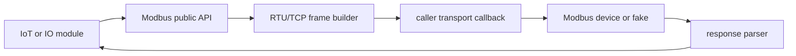
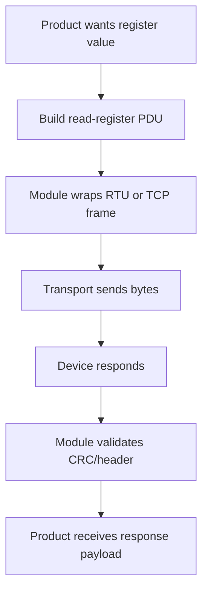

# modbus_zephyr_esp32

Reusable Modbus RTU/TCP adapter module for Linux and Zephyr/ESP32.

## Overview

`modbus_zephyr_esp32` owns Modbus protocol framing and response validation. The
caller supplies the byte transport, so the same module can run with Linux fakes,
TCP sockets, Zephyr UART, or an ESP32-specific transport.

## Key Value

- RTU and TCP request framing.
- CRC16 validation for RTU responses.
- MBAP/TCP response parsing.
- Exception response and timeout coverage.
- Fixed reusable frame buffer for bounded embedded memory behavior.

## How To Use

```c
modbus_zephyr_esp32_configure(&config);
modbus_zephyr_esp32_set_transport(&transport);
modbus_zephyr_esp32_transfer(function, payload, payload_len, &response);
```

```sh
make -f Makefile.linux test
scripts/test_zephyr_module.sh
```

## Architecture Flow



## Example User Scenario



## Simple Principle

This module owns protocol correctness. The caller owns how bytes move.

## Systematic Regression Testing

From the workspace root, run the shared pytest regression module:

```sh
../dephy_testkit/.venv/bin/python -m pytest ../dephy_testkit/tests/regression --module modbus_zephyr_esp32
../dephy_testkit/.venv/bin/python -m pytest ../dephy_testkit/tests/regression --module modbus_zephyr_esp32 --profile integration
```

The local repo test remains:

```sh
make -f Makefile.linux test
```

## Docs

- `docs/module_structure.md`: public API and module layout.
- `docs/todo.md`: current TODO summary.

## License

MIT. See `LICENSE` and `NOTICE.md`. Reuse and references are allowed, but the
copyright notice and attribution to Judd (judadao) must be preserved.
